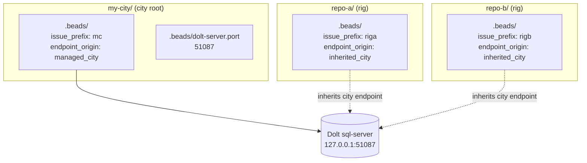
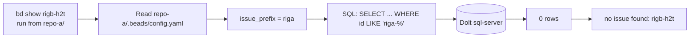

A Gas City workspace can hold beads in several places at once — at the city
root and inside every rig. From the outside that looks like several separate
databases. Underneath it is the opposite: one shared Dolt server, with each
scope's beads tagged by an `issue_prefix` that the `bd` CLI uses as a hard
query filter.

This page explains that topology so the on-disk layout, the contents of each
`.beads/` directory, and the output of `bd list` from different working
directories all line up with one mental model.

## The shape of a city

When you run `gc init`, Gas City lays down a city root with a `.beads/`
directory inside it. When you run `gc rig add <path>`, the target directory
gets its own `.beads/` directory too. So a two-rig city looks like this on
disk:

```
my-city/
├── .beads/
│   ├── config.yaml         # issue_prefix: mc · gc.endpoint_origin: managed_city
│   └── dolt-server.port    # e.g. 51087
└── city.toml

repo-a/                     # added with: gc rig add ../repo-a
└── .beads/
    └── config.yaml         # issue_prefix: riga · gc.endpoint_origin: inherited_city

repo-b/                     # added with: gc rig add ../repo-b
└── .beads/
    └── config.yaml         # issue_prefix: rigb · gc.endpoint_origin: inherited_city
```

There is **one** Dolt server process for the whole city. The city's
`.beads/dolt-server.port` records the port it listens on. Every rig's
`.beads/config.yaml` declares `gc.endpoint_origin: inherited_city`, which means
"use whatever endpoint the city is using." Rigs do not run their own Dolt.



`gc.endpoint_origin` is the canonical key that records who owns the endpoint
declaration. The four legal values are documented in
`internal/beads/contract/files.go`; for a default `gc init` city you will only
ever see two of them:

| Value | Meaning |
|---|---|
| `managed_city` | This city runs its own local Dolt; the port lives in `.beads/dolt-server.port`. |
| `inherited_city` | This rig has no endpoint of its own; resolve through the city. |

The two remaining values, `city_canonical` and `explicit`, are for cities and
rigs that point at an external Dolt server. See the [Beads Dolt Contract
design note](https://github.com/gastownhall/gascity/blob/main/engdocs/design/beads-dolt-contract-redesign.md)
for the full matrix.

## One server, many logical scopes

Even though all three `.beads/` directories resolve to the same Dolt server,
the beads they hold are not interchangeable. Each scope has its own
`issue_prefix` in `.beads/config.yaml`, and `bd` uses that prefix as a hard
filter on every read and write.

This is the part that surprises people: it is not a federated view across
separate databases, and it is not isolated databases either. It is one shared
store with **prefix scoping enforced at the `bd` query layer**.

### A worked example

Start from an empty city and two empty repos, with the rigs added in suspended
state so we can poke at the files without the orchestrator running:

```shell
$ gc init my-city
$ cd my-city
$ gc rig add ../repo-a --start-suspended
$ gc rig add ../repo-b --start-suspended
```

Now create one bead from each rig directory:

```shell
$ cd ../repo-a && bd create "work in repo-a"
created riga-gne

$ cd ../repo-b && bd create "work in repo-b"
created rigb-h2t
```

The two beads live on the same Dolt server, physically next to each other.
But from `repo-a`, `bd` only sees its own:

```shell
$ cd repo-a
$ bd list
○ riga-gne ● P2 work in repo-a

$ bd show rigb-h2t
no issue found: rigb-h2t
```

From the city root, `bd list` shows only the city's own prefix (`mc-*`),
**not** a federated view across rigs:

```shell
$ cd ../my-city
$ bd list
(only mc-* beads — nothing from riga or rigb)
```

### Why `bd show rigb-h2t` from `repo-a` fails

The row is right there on the server. But `bd` reads `.beads/config.yaml` in
its working directory, sees `issue_prefix: riga`, and constrains every query
to that prefix. The `rigb-h2t` row exists; it just is not in this scope's
namespace, so `bd` reports it as not found.



This is intentional. It keeps rig namespaces independent — agents working in
`repo-a` cannot accidentally claim or close `repo-b`'s beads — without the
overhead of running a second Dolt server per rig.

## `gc bd` is just routing sugar

The `gc bd --rig <name> ...` command is a small wrapper that changes directory
into the named rig and runs `bd` there. It does not add a federation layer or
do any cross-rig joining. The implementation
([`cmd/gc/cmd_bd.go`](https://github.com/gastownhall/gascity/blob/main/cmd/gc/cmd_bd.go))
resolves the rig path, sets `cmd.Dir = target.ScopeRoot`, and exec's `bd` with
your arguments. Anything `bd` cannot do from inside the rig, `gc bd` cannot
do either.

If you want a true cross-rig view, query Dolt directly using the port from
`my-city/.beads/dolt-server.port`. The `bd` CLI is intentionally not the tool
for that — its job is to enforce per-scope namespacing.

## Session liveness lives outside version control

Session beads carry two very different kinds of metadata. Identity and config
(`agent_name`, `alias`, `command`, `provider`, `gc.session_name`, `gc.work_dir`)
is durable, mergeable, and belongs in history. Liveness telemetry — `state`,
`awake_started_at`, `last_woke_at`, `slept_at`, `generation`, `instance_token`,
`gc.last_heartbeat_at` and friends — is node-local, last-write-wins, and useless
in history. Writing it into the versioned `issues` table minted a permanent Dolt
commit (~840 KB) per transition, several hundred an hour across a fleet.

Those fields now live in a `session_liveness` table registered in `dolt_ignore`,
so its rows exist only in the working set and never stage, commit, or replicate —
the same mechanism the beads library uses for `leases` and `wisps`. `gc` seeds
the table itself, idempotently, when it first binds a scope.

The split and the merge are both invisible to callers:

- **Writes** are split at the store wrapper. Liveness keys go to the table;
  everything else goes to bead metadata as before. When a patch contained
  nothing but liveness keys, no bead write happens at all — that skipped write
  is the commit that no longer exists.
- **Reads** merge the table back onto `Bead.Metadata` at materialization, so
  every existing consumer sees the same keys it always did. A key with no row
  falls back to whatever the committed metadata holds, so pre-existing session
  beads work with no migration step.

Three consequences worth knowing:

- **`updated_at` on a session bead goes quiet.** Nothing touches the row between
  genuine status transitions. Code that needs a "last we heard from this
  session" clock reads `session.EffectiveUpdatedAt`, which folds in the
  synthetic `gc.liveness_written_at` key the read overlay stamps.
- **Raw SQL against `issues` no longer sees live telemetry.** Anything reading
  session state or `gc.last_heartbeat_at` must come through the `gc` API (or
  join `session_liveness` itself), not through `bd show` or a direct
  `issues`-table query.
- **Do not filter a bead query on a moved key.** The overlay merges values on
  after the store has already selected the beads, so a metadata predicate on
  `state` or `pending_create_claim` matches the stale committed value. Query
  `session_liveness` directly, or filter in memory after the read. (No such
  query exists today — every metadata filter in the tree keys on versioned
  fields.)

`GC_SESSION_LIVENESS_STORE` controls this:

| Value | Behavior |
|---|---|
| `table` (default) | Split writes as above. Liveness keys never reach the versioned table. |
| `metadata` | Rollback. The full patch goes to versioned bead metadata (restoring the commit volume), fenced so the committed value is authoritative; liveness keys are still mirrored into the table so a flip back to `table` finds them current. |

The flag is read once per scope when that scope's store is first bound and
cached for the life of the process, so changing it means restarting the
processes that should observe it — the controller, not just the next CLI call.

**Reads always apply the overlay, in both modes**, because a process cannot know
which mode wrote a given row. What keeps a table row from shadowing a committed
value is a fence, not a mode: any write whose liveness half went to versioned
metadata — a degraded write, a write inside a transaction, or every write under
`metadata` mode — also commits one fence marker **per liveness key it wrote**,
`gc.liveness_fence.<key>`, whose value is the moment of that write. The overlay
drops a key's row when the row was written at or before that key's own marker,
and leaves a key with no marker alone — nothing ever committed a newer value for
it, so its row is the freshest thing anyone has. A later successful table write
is newer than the stamp and takes over again on its own.

Per key, so the markers **accumulate**. A second fallback covering a different
key set adds its own markers and leaves the first one's standing; so does the
second batch of a multi-batch transaction. A single stamp plus a list of fenced
keys would be last-write-wins on both halves, so the later write would un-fence
the earlier one's keys and let their pre-outage rows win again.

That fence is what makes the degraded path safe. A scope whose Dolt endpoint is
unreachable (a `file` or `doltlite` provider, or a server that is down) writes
liveness to versioned metadata instead — it costs commits again until the
endpoint returns, but the rows the outage left behind can never come back and
shadow it. Timestamps on both sides of the comparison are minted on the Dolt
server (`written_at` via `UTC_TIMESTAMP(6)`; the stamp via the clock offset the
store measures when it dials and retains across a retired pool), so a scope
whose Dolt lives on another host compares correctly.

Transactions get one further step. A transaction's fences are minted while its
callback runs, but it does not commit until that callback returns — so a row
another process writes in the gap is stamped *after* the fence and survives it.
Once the transaction commits, `gc` **deletes** the table rows for exactly the
keys it fenced: with no row at all the overlay falls through to the committed
metadata the transaction just made authoritative. That sweep is best-effort and
necessarily runs after the commit, so a crash in the sliver between them leaves
those rows in place — the fence still bounds what can survive, and the next
healthy write for that key overwrites the row.

## Going further

- [`bd` CLI](https://github.com/gastownhall/beads) — upstream documentation for
  `bd create`, `bd list`, `bd ready`, and the rest of the surface `gc bd`
  forwards to.
- [Tutorial 06: Beads](/tutorials/06-beads) — the user-model walkthrough of
  beads as Gas City's universal work primitive.
- [Reference: Config](/reference/config) — every config key, including
  `rig.dolt_port` for advanced topologies.
- [Beads Dolt Contract Redesign](https://github.com/gastownhall/gascity/blob/main/engdocs/design/beads-dolt-contract-redesign.md)
  — the full contributor-side design doc covering all four endpoint origins,
  validation rules, and migration history.
